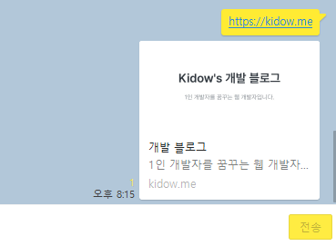

# DynamiSign


DynamiSign은 동적으로 Open Graph Image를 만들 수 있는 기능을 제공합니다.
title과 description을 파라미터로 받으면, 그에 따라 이미지의 내용이 변경됩니다.

# 예시


URL: [https://dynamisign.com/api/sign?d=%EC%A0%9C%EB%AA%A9%EC%9D%84%20t%EB%A1%9C,%20%EB%82%B4%EC%9A%A9%EC%9D%80%20d%EB%A1%9C%20%ED%8C%8C%EB%9D%BC%EB%AF%B8%ED%84%B0%EB%A5%BC%20%EC%A0%84%EB%8B%AC%ED%95%A9%EB%8B%88%EB%8B%A4.&t=%EB%8F%99%EC%A0%81%EC%9C%BC%EB%A1%9C%20%EC%9D%B4%EB%AF%B8%EC%A7%80%EC%9D%98%20%EB%82%B4%EC%9A%A9%EC%9D%84%20%EB%B3%80%EA%B2%BD%ED%95%98%EB%8A%94%20%EB%B2%95](url)

# 사용 방법

해당 이미지는 다음과 같은 주소로 만들어 집니다.

> https://dynamisign.com/api/sign?t=[title]&d=[description]

title에 제

html meta tag 중 `og:image` 혹은 `twitter:image`를 속성값으로 주고 `content` 에 해당 url을 넣으면 자동으로 이미지가 반영됩니다.

```html
<html>
    <head>
        ...
        <meta property="og:image" content="https://dynamisign.com/api/sign">
        <meta property="twitter:image" content="https://dynamisign.com/api/sign">
        ...
    </head>
</html>
```

